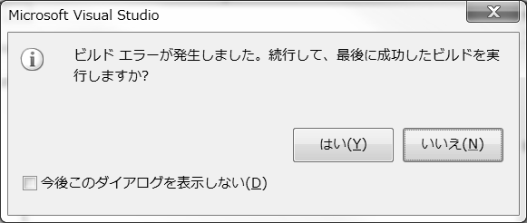
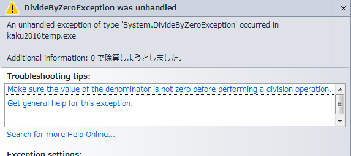

# 問題の解消＝デバッグ

## エラーウィンドウ
以下のようなウィンドウが表示されたら「はい」「いいえ」を選ぶこと。

## エラー場所を見つける方法
ErrorListのエラーメッセージをクリック

ErrorListの単語をよく見る。

## DivideByZeroException ウィンドウ
以下のようなエラーが表示された時の対処方法を記せ。

### 対処方法
1.入力された値によって、型や０で割れないなどがある。
2.ヒントを参照
3.Debugメニュー　>　Stop Debuggingでプログラムを停止

## 代表的な5つのエラーを以下に記せ
1.つづり間違え
2.全角入力
3.書く場所　順番｛｝にも注意
4.｛(　開いた後とじる。→）｝
5.実行時のテキストボックス入力間違い（型、未入力）
6.VisualStadioが自動的に追加したコードをけす。（ボタンとか）

---

[前へ](README.md#%E3%83%97%E3%83%AD%E3%82%B0%E3%83%A9%E3%83%9F%E3%83%B3%E3%82%B0%E3%81%AE%E8%82%9D) | [目次へ](README.md#%E7%9B%AE%E6%AC%A1) | [次へ](04.md)
